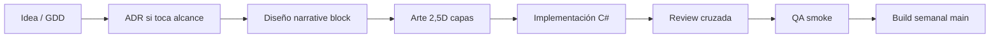

# Carta operativa — Taller Umbral

**Documento:** operación del estudio ficticio · **Proyecto:** *Umbral* (Unity, C#) · **Versión:** 1.0 (2026-09-19)

> Exportar a PDF (máx. 6 páginas) como `estudio/carta-operativa.pdf` para C Digital.

---

## 1. Organigrama y roles (equipo objetivo: 6 FTE)

| Rol | N.º | Responsabilidad cuando algo sale mal |
|-----|-----|--------------------------------------|
| **Director creativo / Game Director** | 1 | Desalineación de pilares vs contenido en build |
| **Producer** | 1 | Scope creep, ADR sin dueño, fechas de hito incumplidas |
| **Tech Lead (C#)** | 1 | Deuda técnica, regresiones de guardado/flags |
| **Lead Narrative Designer** | 1 | Dilemas que no alteran estado del mundo |
| **Art Lead 2,5D** | 1 | Retrabajo por definición de “entregado” en arte |
| **QA / Release** | 1 | Build rota en rama main, checklist de vertical slice |

**Meses 1–3 (preproducción):** 2 personas (Director + Tech Lead). **Mes 4:** +Art +Narrative. **Mes 6:** +Producer +QA full-time.

---

## 2. Pipeline y workflow

**Puntos de revisión:** (1) Narrative aprueba dilema ↔ flag; (2) Tech Lead aprueba merge C#; (3) Producer aprueba merge si toca alcance (ADR 004). **Build:** viernes 17:00 — artefacto numerado `Umbral_YYYY-MM-DD`.

---

## 3. Documentación y nomenclatura

- **Assets Unity:** `CONTRIBUTING.md` §3–5 (convenciones nativas; Unreal solo referencia §1–2).
- **Decisiones:** `decisiones/NNN-*.md` (Anexo B ACA 2).
- **¿Qué pasa si quien escribió el sistema no está?** Todo sistema de vínculos documenta en `BondProgressionConfig.asset` + comentario XML en `ThaiBondController.cs`; ADR explica *por qué*, no solo *qué*.

---

## 4. Marco de trabajo

**Híbrido Scrum light** (ADR 003): sprint **2 semanas**; **daily 15 min**; **planning** con checklist ADR; **review** con demo jugable; **retro** con revisión del indicador del antídoto.

**Eliminado:** daily de status por chat sin demo; reportes semanales en slide duplicando GitHub.

**Definition of Done (equipo):** feature mergeada + flag probado + entrada en build notes + si aplica ADR enlazada.

---

## 5. Cronograma hipotético

| Fase | Meses | Hito | Fecha (supuesto inicio ene-2027) |
|------|-------|------|----------------------------------|
| Preproducción | 1–3 | GDD congelado + prototipo flags | Abr 2027 |
| Vertical slice | 4–6 | Playtest Bosque + Thai eco | Jul 2027 (sem. ~22) |
| Producción MVP | 7–9 | MVP jugable 2 actos | Oct 2027 (**mes 9**) |
| Pulido / cert | 10–15 | Beta cerrada | 2028 |
| Lanzamiento | 18 | Release 1.0 | Jul 2028 |

**Ruta crítica:** progresión Thai + sistema flags → bloquea contenido acto 2. **Supuesto productividad:** 6 FTE × 0,7 factor creativo efectivo (pérdida ceremonias/rework) = ~4,2 FTE equivalentes en pico.

Detalle: `estudio/cronograma.md`.

---

## 6. Presupuesto hipotético

**Método:** salario mediano Colombia 2026 por rol (referencia mercado local y tablas sector TI/creativos), **+52 %** carga prestacional; licencias Unity Pro × 6 asientos meses 4–18; hardware amortizado 36 meses; **contingencia 15 %** sobre OPEX anual.

| Concepto | Cálculo resumido |
|----------|------------------|
| Nómina mes pico (6 FTE) | ~$48 M COP/mes loaded (estimado) |
| Meses 1–3 (2 FTE) | ~$16 M COP/mes |
| Burn rate promedio ponderado | ~$38 M COP/mes |
| Ronda solicitada | ~$420 M COP → **~11 meses** pico equivalente; MVP mes 9 dentro de ventana con preproducción barata |
| Colchón post-MVP | 2 meses para tracción / siguiente ronda sin apagar estudio |

Detalle líneas: `estudio/presupuesto.md`.

---

## 7. Acuerdo de trabajo

- **Retroalimentación:** SBI en review de sprint; crítica al trabajo, no a la persona.
- **Sin consenso:** decide Producer con criterio escrito en ADR en 48 h; desacuerdo registrado obligatorio.
- **Sobretiempo:** no esperado; excepción solo con ADR/evento de excepción + registro en retro (máx. 3 por trimestre).
- **Error costoso:** postmortem ligero 24 h; foco en sistema, no culpa individual.
- **Desconexión:** no se exigen respuestas fuera de 09:00–18:00 COL; builds automáticas no requieren presencia nocturna.

---

## 8. El antídoto (patrón 6)

### 8.1 Patrón elegido

**6 · La decisión que nadie recuerda** — ver `diagnostico/patron-de-fallo.md`.

### 8.2 Evidencia hacia adentro

ACA 1: Anexo A no publicado sin declaración escrita de supuesto; salida de integrante sin acta de handoff; Documento 2 citó Documento 1 como fuente externa; retroalimentación docente (C2–C3). ACA 2: adopción explícita de ADR (este repo).

### 8.3 Evidencia hacia afuera

Telltale 2017: declaración pública de “menos juegos, mayor calidad” vs ejecución reportada (Favis, 2019).

### 8.4 Mecanismo

**Regla de merge (ADR 004):** ningún cambio a alcance en `gdd/GDD.md` / `gdd/GDD.pdf` sin ADR *Aceptada* enlazada en el merge commit o PR.  
**Dueño:** Producer (Manuel Domínguez en operación del repo; rol Producer en estudio ficticio).  
**Opera solo:** el historial GitHub es la fuencia; no requiere “acordar de nuevo” en reunión.

### 8.5 Indicador (90 días)

**0** merges a `main` que modifiquen sección «Alcance» del GDD sin enlace a ADR válida; auditoría quincenal del log por QA/Release. **Alarma:** ≥1 incumplimiento o **silencio total** (equipo evade la regla).

---

## 9. Plan de acción post-fundación (Anexo C)

| # | Acción | Responsable | Fecha | Indicador verificable |
|---|--------|-------------|-------|------------------------|
| 1 | Publicar plantilla PR con checkbox ADR | Tech Lead | Semana 1 | `.github/pull_request_template.md` en repo |
| 2 | Inventario ADR 001–005 aceptados | Producer | Semana 2 | 5 archivos en `decisiones/` estado Aceptada |
| 3 | Tag `mvp-lock` en git al congelar alcance | Producer | Mes 9 | Tag visible en GitHub |
| 4 | Auditoría quincenal alcance vs GDD | QA | Cada 2 semanas | Acta en issue cerrado con enlace a commits |
| 5 | Playtest vertical slice Thai | Game Director | Sem. 22 | Informe con % comprensión vínculo (ADR 002) |

---

## 10. Análisis de riesgos

| Riesgo | P. | I | Señal temprana | Mitigación · responsable |
|--------|----|---|----------------|---------------------------|
| **Técnico:** corrupción saves/flags | M | A | Bug reports duplicados | Tests automatizados flags · Tech Lead |
| **Técnico:** deuda Unity upgrade | M | M | Warnings LTS fin | Pin LTS en ADR · Tech Lead |
| **Técnico:** performance 2,5D mobile | B | M | FPS < 55 en target | Scope plataforma PC first · Producer |
| **Humano:** crunch invisible | M | A | Commits fuera horario 3 sem seguidas | Retro + ADR excepción · Producer |
| **Humano:** patrón 6 reaparece | M | A | PR sin ADR | Bloqueo review · Producer |
| **Humano:** conflicto creativo Thai vs scope | A | M | Reapertura ADR 002 sin datos | Gate playtest 70 % · Game Director |
| **Producción:** retraso vertical slice | M | A | 2 sprints sin demo | Recorte bioma · Producer |
| **Producción:** burn > 110 % plan | M | A | Forecast mes 4 | Congelar contratación · Director |
| **Producción:** licencia Unity costo | B | M | Factura > presupuesto | Unity Personal/Pro revisión · Producer |

*P = probabilidad (B/M/A). I = impacto (B/M/A).*

---

## Referencias

Favis, E. (2019, April 9). *The rise and fall of Telltale Games*. Game Informer. https://www.gameinformer.com/feature/2019/04/09/the-rise-and-fall-of-telltale-games
