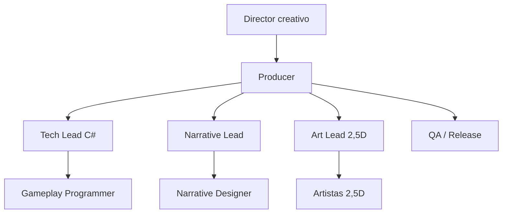

# Organigrama — Taller Umbral (mes 6+, 6 FTE)

```mermaid
flowchart TB
  DIR[Director creativo]
  PRO[Producer]
  DIR --> PRO
  PRO --> TL[Tech Lead C#]
  PRO --> NL[Narrative Lead]
  PRO --> AL[Art Lead 2,5D]
  PRO --> QA[QA / Release]
  TL --> DEV[Gameplay Programmer]
  NL --> WRI[Narrative Designer]
  AL --> ART[Artistas 2,5D]
```

*Meses 1–3: solo Director + Tech Lead activos (presupuesto escalonado).*
