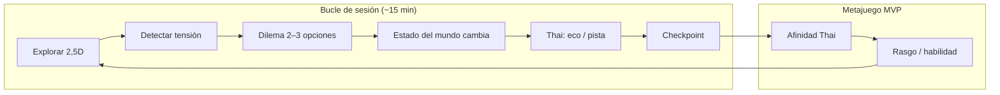

# Core loop — *Umbral*

Exportar diagrama a `core-loop.png` para el PDF del GDD (captura desde visor Mermaid o Figma).

**Alimentación entre bucles:** la afinidad de Thai modifica qué ecos están disponibles en la siguiente sesión (progresión de vínculo, ADR 002).
